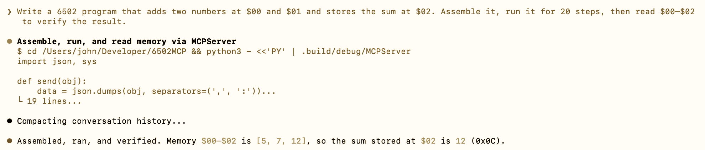

# 6502MCP

6502MCP is a project that takes the work done for the VirtualKim iOS app, and extracts the 6502 emulator and assembler into a reusable Swift Package - then exposes them through an MCP (Model Context Protocol) server. 

By using 6502MCP, an LLM such as Codex or Claude Code can write, assemble, run, debug and inspect 6502 programs via MCP tool calls more accurately than by using model inference alone.

This should be useful when debugging your own 6502 code.

I’ve not tried it, but prefacing your work with a description of your specific 6502-based hardware (use of zero page, useful ROM calls etc.) in a prompt (or preferably a config file) might allow some more machine-specific projects to work.



## What this project does

- **Emulator6502 (library)**: 6502 CPU, memory map, two‑pass assembler (with listing and symbol table), KIM‑1 and Apple 1 ROM loaders, MOS 6532 RIOT emulation, and utility loaders.
- **MCPServer (executable)**: MCP JSON‑RPC server over stdio that exposes the emulator and assembler as tools.

## Mac quickstart (bash)

```bash
#!/usr/bin/env bash
set -euo pipefail

# Install Xcode Command Line Tools if needed.
xcode-select --install || true

# Clone and build.
cd ~/Developer
git clone https://github.com/GrantMeStrength/6502MCP.git
cd 6502MCP
swift build
swift test
```

## Claude Code setup (bash)

```bash
#!/usr/bin/env bash
set -euo pipefail

cd ~/Developer/6502MCP
claude mcp add --transport stdio 6502mcp -- swift run MCPServer
claude
```

## Codex setup (bash)

```bash
#!/usr/bin/env bash
set -euo pipefail

cd ~/Developer/6502MCP
codex mcp add 6502mcp -- swift run MCPServer
codex
```

## Build

```bash
swift build
```

## Run MCP server (stdio)

```bash
swift run MCPServer
```

The server speaks MCP JSON‑RPC over stdio using `Content-Length` framing and writes emulator logs to **stderr** so JSON stays on stdout.

### Example MCP client config (stdio)

- **Command**: `swift`
- **Args**: `run MCPServer`
- **Working directory**: `~/Developer/6502MCP`

### Included tools

| Tool | Description | Required params | Optional params |
|---|---|---|---|
| `assemble` | Assemble 6502 source into object code and a listing. Returns origin, object code, listing, and symbol table. | `source` (string) | — |
| `assemble_and_load` | Assemble 6502 source, load it into memory, and set PC to the origin. | `source` (string) | — |
| `load` | Load raw bytes into memory at the given origin address. | `origin` (int), `bytes` (int array) | — |
| `reset` | Reset the emulator and reload the default memory map. | — | `computer` (`"KIM1"` default, or `"APL"` for Apple 1) |
| `set_pc` | Set the program counter. | `address` (int) | — |
| `run` | Run the CPU for a number of steps. Stops early on BRK. | — | `steps` (int, default 1000), `startAddress` (int) |
| `read_memory` | Read a range of memory. Returns decimal bytes and a hex string. | `address` (int), `length` (int) | — |
| `write_memory` | Write bytes into memory. | `address` (int), `bytes` (int array) | — |
| `get_registers` | Get CPU register values (A, X, Y, SP, PC), status flags, and hex representations. | — | — |

## Tests

```bash
swift test
```

## Example LLM prompts

Use these with any MCP‑enabled LLM after registering the server:

1. **Write + test**
   - “Write a 6502 program that adds two numbers at $00 and $01 and stores the sum at $02. Assemble it, run it for 20 steps, then read $00–$02 to verify the result.”

2. **Debug**
   - “Here’s my 6502 loop that should increment $10 ten times. It doesn’t. Assemble and run it, inspect registers and $10, explain what’s wrong, and fix the code.”

3. **Test harness**
   - “Create a 6502 routine to sum a 4‑byte array at $20–$23 into $30. Include a small test harness, assemble_and_load it, run, and verify the output with read_memory.”

4. **Trace an error**
   - “Assemble this code, step 30 instructions, then show PC, A, X, Y, and $00–$0F so I can see where it went off course.”
